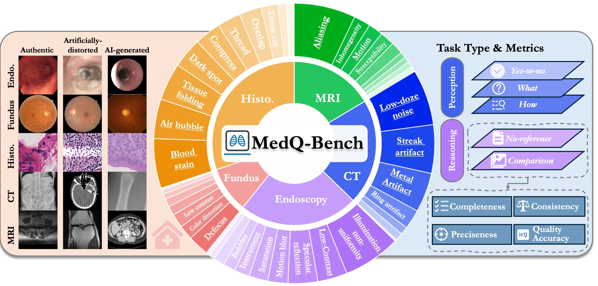
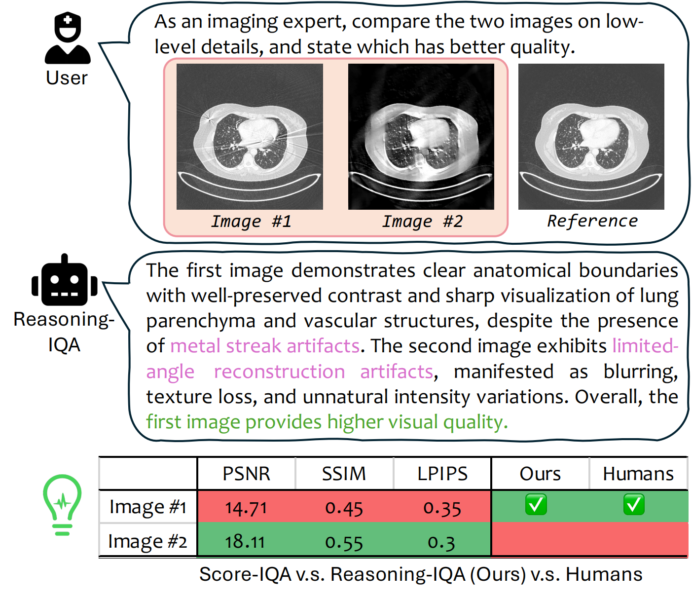
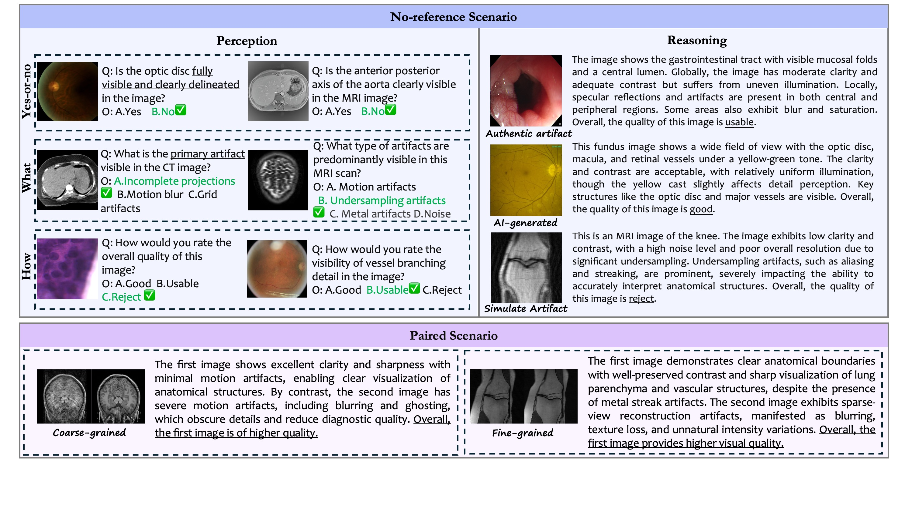

<div align="center">
<div style="width: 20%; text-align: center; margin:auto;">
    
</div>

# MedQ-Bench: Evaluating and Exploring Medical Image Quality Assessment Abilities in MLLMs

_Bridging the gap between traditional medical IQA and human-like reasoning with Multi-modal Large Language Models_

[](https://arxiv.org/abs/2510.01691)
[](https://opensource.org/licenses/Apache-2.0)
[](https://www.python.org/downloads/release/python-380/)
<div>
<strong>Jiyao Liu<sup>1*</sup>, Jinjie Wei<sup>1*</sup>, Wanying Qu<sup>1</sup>, Chenglong Ma<sup>1,2</sup>, Junzhi Ning<sup>2</sup>, Yunheng Li<sup>1</sup>, Ying Chen<sup>2</sup>, Xinzhe Luo<sup>3</sup>, Pengcheng Chen<sup>2</sup>, Xin Gao<sup>1</sup>, Ming Hu<sup>2</sup>, Huihui Xu<sup>2</sup>, Xin Wang<sup>2</sup>, Shujian Gao<sup>1</sup>, Dingkang Yang<sup>1</sup>, Zhongying Deng<sup>4</sup>, Jin Ye<sup>2</sup>, Lihao Liu<sup>2†</sup>, Junjun He<sup>2†</sup>, Ningsheng Xu<sup>1</sup></strong>
</div>

<div>
<sup>1</sup>Fudan University, <sup>2</sup>Shanghai Artificial Intelligence Laboratory, <sup>3</sup>Imperial College London, <sup>4</sup>University of Cambridge
</div>

<div>
<sup>*</sup>Equal contribution. <sup>†</sup>Corresponding author.
</div>

<div style="width: 100%; text-align: center; margin:auto;">
    
</div>
</div>

## 🔥 News

- **[2025.01]** MedQ-Bench paper submitted to arXiv
- **[2025.01]** Dataset publicly released on Hugging Face
- **[Coming Soon]** Initial code release and benchmark evaluation
- **[Coming Soon]** VLMEvalKit integration

## 🎯 Overview

**MedQ-Bench** is the first comprehensive benchmark for evaluating **Medical Image Quality Assessment (IQA)** capabilities of Multi-modal Large Language Models (MLLMs). Unlike traditional score-based IQA methods, MedQ-Bench introduces a **perception-reasoning paradigm** that mirrors clinicians' cognitive workflow for quality assessment.
<div align="center">
<div style="width: 50%; text-align: center; margin:auto;">
    
    <p><em>Comparison of traditional score-based IQA vs. our reasoning-based approach. Unlike purely numerical scores, reasoning IQA identifies distortion types and their relative impact, yielding results more consistent with human judgment.</em></p>
</div>
</div>

### 🔍 Key Innovations

- **🏥 Medical-Specialized Focus**: Designed specifically for medical imaging quality assessment across 5 modalities
- **🧠 Perception-Reasoning Paradigm**: Evaluates both Visual quality perceptual abilities and reasoning skills
- **📊 Comprehensive Evaluation**: 3,308 samples covering 40+ quality attributes with multi-dimensional assessment
- **👨‍⚕️ Human-AI Alignment**: Validated against expert radiologist assessments with strong correlation (κw > 0.77)

## 🏗️ Benchmark Architecture

### 📋 Two Complementary Tasks

<div style="width: 100%; text-align: center; margin:auto;">
    
    <p><em>Examples of MedQ-Bench evaluation tasks across different modalities, covering perception (MCQA) tasks, no-reference reasoning, and comparative reasoning scenarios.</em></p>
</div>

1. **MedQ-Perception**: Probes low-level perceptual capability via human-curated questions
   - Yes-or-No, What, How question types
   - General medical vs. modality-specific questions
   - No degradation vs. mild/severe degradation levels

2. **MedQ-Reasoning**: Encompasses reasoning tasks aligning with human-like quality assessment
   - **No-reference reasoning** (single image analysis with detailed quality description)
   - **Comparative reasoning** (paired image evaluation and comparison)
   - Coarse-grained vs. fine-grained difficulty levels

### 🏥 Coverage Across Medical Imaging

| Modality | Samples | Key Degradation Types |
|----------|---------|----------------------|
| **CT** | 878 | Metal artifacts, noise, streak artifacts, ... |
| **MRI** | 848 | Motion artifacts, undersampling, susceptibility, ... |
| **Histopathology** | 758 | Staining artifacts, focus issues, compression, ... |
| **Endoscopy** | 555 | Illumination, specular reflection, motion blur, ... |
| **Fundus** | 269 | Color distortion, illumination, contrast issues, ... |

### 🎯 Multi-Dimensional Evaluation

**Reasoning Tasks Assessed via 4 Dimensions:**
- **Completeness** (0-2): Coverage of key visual information
- **Preciseness** (0-2): Consistency with reference assessment
- **Consistency** (0-2): Logical coherence between reasoning and conclusion
- **Quality Accuracy** (0-2): Correctness of final quality judgment

## 📊 Key Findings

### 🏆 Model Performance Hierarchy

| Model Category | Best Performer | Overall Score |
|----------------|----------------|---------------|
| **Commercial** | GPT-5 | 68.97% |
| **Open-Source** | Qwen2.5-VL-72B | 63.14% |
| **Medical-Specialized** | MedGemma-27B | 57.16% |

### 🔍 Critical Insights

1. **Substantial Human-AI Performance Gap**: Despite achieving above-random performance, the best-performing AI model (GPT-5: 68.97%) significantly underperforms human experts (82.50%), leaving a **13.53% gap** that highlights insufficient accuracy for reliable clinical deployment without further optimization

2. **Mild Degradation Detection Challenges**: Models exhibit weakest performance on mild degradations (average 56% accuracy) compared to no degradation (72%) and severe degradation (67%), indicating difficulty in detecting subtle quality issues precisely where reliable quality control is most clinically critical

3. **Medical-Specialized Models Underperform**: Contrary to expectations, medical-specialized models (best: MedGemma-27B at 57.16%) consistently lag behind general-purpose models, suggesting current domain adaptation strategies may prioritize high-level diagnostic reasoning over fundamental low-level visual perception capabilities required for quality assessment

4. **Limited Reasoning Capabilities**: Even advanced models achieve only moderate scores in completeness (1.293/2.0) and preciseness (1.556/2.0) for reasoning tasks, demonstrating preliminary but unstable perceptual and reasoning abilities insufficient for complete and accurate quality descriptions

## 🚀 Getting Started

### 📦 Installation

**[Coming Soon]** 

### 💾 Dataset Access

The MedQ-Bench dataset has been made available through **🤗 Hugging Face** ([jiyaoliufd/MedQ-Bench](https://huggingface.co/datasets/jiyaoliufd/MedQ-Bench))


### 🔬 Evaluation

**[Coming Soon]** Evaluation code and VLMEvalKit integration will be available after initial code release.

## 📈 Leaderboard

### Perception Tasks (Test Set)

| Rank | Model | Yes-or-No ↑ | What ↑ | How ↑ | Overall ↑ |
|------|-------|-------------|--------|-------|-----------|
| 🥇 | GPT-5 | **82.26%** | **60.47%** | 58.28% | **68.97%** |
| 🥈 | GPT-4o | 78.48% | 49.64% | 57.32% | 64.79% |
| 🥉 | Qwen2.5-VL-72B | 78.67% | 42.25% | 56.44% | 63.14% |
| 🥉 | Grok-4 | 73.30% | 48.84% | **59.10%** | 63.14% |
| 5 | Gemini-2.5-Pro | 75.13% | 55.02% | 50.54% | 61.88% |

### No-Reference Reasoning Tasks (Test Set)

| Rank | Model | Comp. ↑ | Prec. ↑ | Cons. ↑ | Qual. ↑ | Overall ↑ |
|------|-------|---------|---------|---------|---------|-----------|
| 🥇 | GPT-5 | **1.195** | **1.118** | 1.837 | 1.529 | **5.679** |
| 🥈 | GPT-4o | 1.009 | 1.027 | 1.878 | 1.407 | 5.321 |
| 🥉 | Qwen2.5-VL-32B | 1.077 | 0.928 | **1.977** | 1.290 | 5.272 |
| 4 | Gemini-2.5-Pro | 0.878 | 0.891 | 1.688 | **1.561** | 5.018 |
| 5 | Grok-4 | 0.982 | 0.846 | 1.801 | 1.389 | 5.017 |

### Comparative Reasoning Tasks (Test Set)

| Rank | Model | Comp. ↑ | Prec. ↑ | Cons. ↑ | Qual. ↑ | Overall ↑ |
|------|-------|---------|---------|---------|---------|-----------|
| 🥇 | GPT-5 | **1.293** | **1.556** | 1.925 | **1.564** | **6.338** |
| 🥈 | GPT-4o | 1.105 | 1.414 | 1.632 | 1.562 | 5.713 |
| 🥉 | Grok-4 | 1.150 | 1.233 | 1.820 | 1.459 | 5.662 |
| 4 | Gemini-2.5-Pro | 1.053 | 1.233 | 1.774 | 1.534 | 5.594 |
| 5 | InternVL3-8B | 0.985 | 1.278 | 1.797 | 1.474 | 5.534 |

*Scores are on a 0-2 scale for each dimension*

## 📊 Analysis & Insights

### Performance by Modality

- **Best Overall**: CT and MRI imaging (higher contrast, clearer artifacts)
- **Most Challenging**: Histopathology (subtle staining variations, texture complexity)
- **Modality Gap**: 15-20% performance difference between easiest and hardest modalities

### Error Analysis

1. **Perception Errors**: Difficulty distinguishing mild vs severe degradations
2. **Reasoning Gaps**: Incomplete description of quality factors
3. **Consistency Issues**: Mismatch between observed artifacts and quality conclusion
4. **Medical Knowledge**: Limited understanding of clinical significance


## 🤝 Contributing

We welcome contributions! Please see our [Contributing Guidelines](CONTRIBUTING.md) for details.


## 📄 Citation

If you use MedQ-Bench in your research, please cite our paper:

```bibtex
@misc{liu2025medqbenchevaluatingexploringmedical,
      title={MedQ-Bench: Evaluating and Exploring Medical Image Quality Assessment Abilities in MLLMs},
      author={Jiyao Liu and Jinjie Wei and Wanying Qu and Chenglong Ma and Junzhi Ning and Yunheng Li and Ying Chen and Xinzhe Luo and Pengcheng Chen and Xin Gao and Ming Hu and Huihui Xu and Xin Wang and Shujian Gao and Dingkang Yang and Zhongying Deng and Jin Ye and Lihao Liu and Junjun He and Ningsheng Xu},
      year={2025},
      eprint={2510.01691},
      archivePrefix={arXiv},
      primaryClass={cs.CV},
      url={https://arxiv.org/abs/2510.01691},
}
```

## 📞 Contact

- **Jiyao Liu**: [jiyaoliu.fudan@gmail.com](mailto:jiyaoliu.fudan@gmail.com)
- **Lihao Liu**: [liulihao@pjlab.org.cn](mailto:liulihao@pjlab.org.cn)
- **Junjun He**: [hejunjun@pjlab.org.cn](mailto:hejunjun@pjlab.org.cn)


## 🙏 Acknowledgments

- **[Q-Bench](https://github.com/Q-Future/Q-Bench) Team**: For the foundational framework for vision quality assessment
- **[VLMEvalKit](https://github.com/open-compass/VLMEvalKit)**: For the comprehensive evaluation infrastructure
- **All Radiologists**: Who contributed to human evaluation and validation

## 📜 License

This project is licensed under the Apache License 2.0 - see the [LICENSE](LICENSE) file for details.

---

<div align="center">

**🌟 Star us on GitHub if MedQ-Bench helps your research! 🌟**

</div>